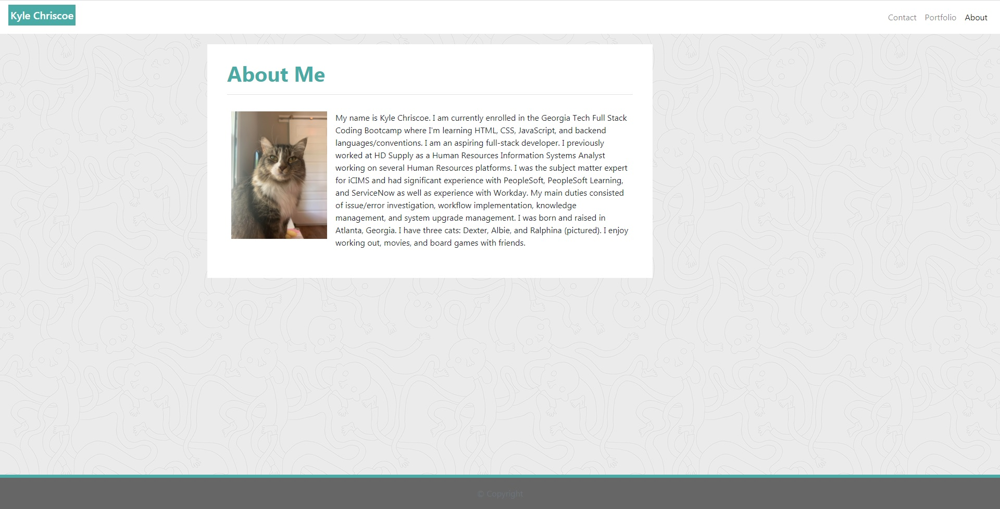

# Kyle Chriscoe - Portfolio

## Repository

This repository hosts my personal portfolio.  It includes the framework HTML, styling CSS, and all images used on my portfolio site.

## Table of Contents

* [My Portfolio](#portfolio)
* [Installation](#installation)
* [Usage](#usage)
* [Development Roadmap](#development_roadmap)
* [Contributing to My Portfolio](#contributing)
* [Credits/Resources](#credits)
* [License](#license)

## My Portfolio

Site link: [https://udunomancer.github.io/gt-ft-portfolio/](https://udunomancer.github.io/gt-ft-portfolio/)

This portfolio houses my personal and Georgia Tech Bootcamp coding projects.  It has three pages:
* The contact page to send me a personal message
* The about page with my personal details
* The portfolio page that contains my projects

## Installation

If you'd like to use this page as a template, feel free to fork the repository at [https://github.com/Udunomancer/gt-ft-portfolio.git](https://github.com/Udunomancer/gt-ft-portfolio.git).

## Usage

All pages should be responsive across all screen types/sizes.  Links in the header should navigate as follows on all pages:
* My name should act as a "Home" button and navigate to index.html
* Contact should navigate to contact.html
* Portfolio should navigate to portfolio.html
* About should navigate to index.html

## Development Roadmap

**Recent Changes**

Initial Repository/Page Deployment (12/8/2020)
* Added Contact, Portfolio, and About pages
* Added unified header/footer across all pages
* Added Bootstrap styling for responsive design

**Future Roadmap**

* Remove duplicate header/footer content from individual pages. Add as html to be loaded to page for code maintainability reasons
* Update Contact page to log input/send message
* Update Portfolio to contain projects

## Contributing to My Portfolio

No direct contributions to this repository, but if you're aware of any work I've done that you think should be added please contact me!

## Credits/Resources

Referenced the following for styling Bootstrap styling options:
* [StackOverflow question on NavBar alignment](https://stackoverflow.com/questions/19733447/bootstrap-navbar-with-left-center-or-right-aligned-items)
* [Sticky Footer](https://getbootstrap.com/docs/4.0/examples/sticky-footer-navbar/)
* [StackOverflow question on text wrapping around image](https://stackoverflow.com/questions/49225505/how-to-make-text-wrap-around-image-with-bootstrap-4-without-float)

## License

[License](assets/license.txt)